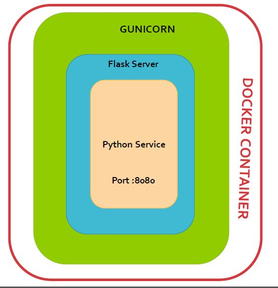

[](https://dev.azure.com/swiftops/swiftops/_build/latest?definitionId=1)

# Git Change Log Microservice

This microservice is used to fetch git change log data for given git repository between its tags. It lists newly added and modified files name, retuns short-stat of total count changed file from previous tags also detail logs with commit details, author for given duration in input. Refer Swagger api after installation.

## Installation
### Checkout Repository
```
$git clone https://github.com/swiftops/MS-GitChangeLog.git
```

### 1. Deploy inside Docker
---
##### Pre-Requisite:
* Docker should be installed on your machine. Refer [Install Docker](https://www.digitalocean.com/community/tutorials/how-to-install-and-use-docker-on-ubuntu-16-04) documentation.
*  Git repository should be checked out locally. 
   e.g  Lets say you have cloned jenkins repository at `/app/work/salm_core`
   + ssh url (git@github.com:jenkinsci/jenkins.git)
   + http url (https://github.com/jenkinsci/jenkins.git)
*  Git repository remote should be set with credentials, no further git operation will prompt for credentials.
    e.g (http://<username:password@git-host>/<git-repositiory>) for http
    ssh key required to set for ssh url
*  Change property file
   + gitconfig.ini to change working directory path, customer maping and path to include from working directory.
   + setup.py to change URL

    
##### Steps to start microservice
Once you  done with pre-requisite exeute below command to start git change log microservice
```
docker build -t <image-name>
docker run -p 5005:5005 -v <hostpath for mounting repo>:/app/work/salm_core --name ms-gitchangelog -d <image-name>
```
#### To access Microservice Swagger API Documentation
```
http://<yourip>:5005/ui
```
Note - To get your IP in api url change host property in swagger.yaml and restart service.

#### To access Microservice
```
e.g
http://<yourip>:5005/api/gitchangelog/v1/shortstat/salm_core/Rel_4.4.0_Rel_4.5.0
```
### 2. On Commit Auto-deploy on specific server.
---
To autodeploy your docker container based service on server used below steps
* You need to configure Gitlab Runner to execute Gitlab CI/CD Pipeline. See [Gitlab Config](https://docs.gitlab.com/runner/install)
As soon as you configure runner auto deployment will start as you commited the code in repository.
refer .gitlab-ci.yml file.

### 3. Deploy on local environment.
----
##### Pre-Requisite
* Git repository should be checked out locally.
   e.g  Lets say you have cloned jenkins repository at `/app/work/salm_core`
   + ssh url (git@github.com:jenkinsci/jenkins.git)
   + http url (https://github.com/jenkinsci/jenkins.git)
* Git repository remote should be set with credential, no further git operation will prompt for credentials.
      e.g (http://<username:password@git-host>/<git-repositiory>) for http
      ssh key required to set for ssh url
*  Change property file
   + gitconfig.ini to change working directory path, customer maping and path to include from working directory.
   + setup.py to change URL
 
#### Create Virtual Environment
Virtualenv is the easiest and recommended way to configure a custom Python environment for your services.
To install virtualenv execute below command:
```sh
$pip3 install virtualenv
```
You can check version for virtual environment version by typing below command:
```sh
$virtualenv --version
```
Create a virtual environment for a project:
```
$ cd <my_project_folder>
$ virtualenv virtenv
```
virtualenv `virtenv` will create a folder in the current directory which will contain the Python executable files, and a copy of the pip library which you can use to install other packages. The name of the virtual environment (in this case, it was `virtenv`) can be anything; omitting the name will place the files in the current directory instead.

This creates a copy of Python in whichever directory you ran the command in, placing it in a folder named `virtenv`.

You can also use the Python interpreter of your choice (like python3.6).
```
$virtualenv -p /usr/bin/python3.6 virtenv
```
To begin using the virtual environment, it needs to be activated:
```
$ source virtenv/bin/activate
```
The name of the current virtual environment will now appear on the left of the prompt (e.g. (virtenv)Your-Computer:your_project UserName$) to let you know that it’s active. From now on, any package that you install using pip will be placed in the virtenv folder, isolated from the global Python installation. You can add python packages needed in your microservice decelopment within virtualenv. 

#### Install python module dependanceies
```
pip install -r requirements.txt
```
#### To start microservice 
```
python services.py
```
#### To access Microservice Swagger API Documentation
```
http://<yourip>:5005/ui
```
Note - To get your IP in api url change host property in swagger.yaml and restart service.


#### To access Microservice
```
e.g http://<yourip>:5005/api/gitchangelog/v1/shortstat/jenkins/jenkins-2.142..jenkins-2.143
```
### Architechture


##### Flask
Flask is a micro web framework written in Python. It is classified as a microframework because it does not require particular tools or libraries.It has no database abstraction layer, form validation, or any other components where pre-existing third-party libraries provide common functions. However, Flask supports extensions that can add application features as if they were implemented in Flask itself.
http://flask.pocoo.org/docs/1.0/quickstart/


##### Gunicorn
The Gunicorn "Green Unicorn" (pronounced gee-unicorn)[2] is a Python Web Server Gateway Interface (WSGI) HTTP server. 

###### Features
* Natively supports WSGI, web2py, Django and Paster
* Automatic worker process management
* Simple Python configuration
* Multiple worker configurations
* Various server hooks for extensibility
* Compatible with Python 2.6+ and Python 3.2+[4]
http://docs.gunicorn.org/en/stable/configure.html

##### Docker 
Container platform
https://www.docker.com/get-started


